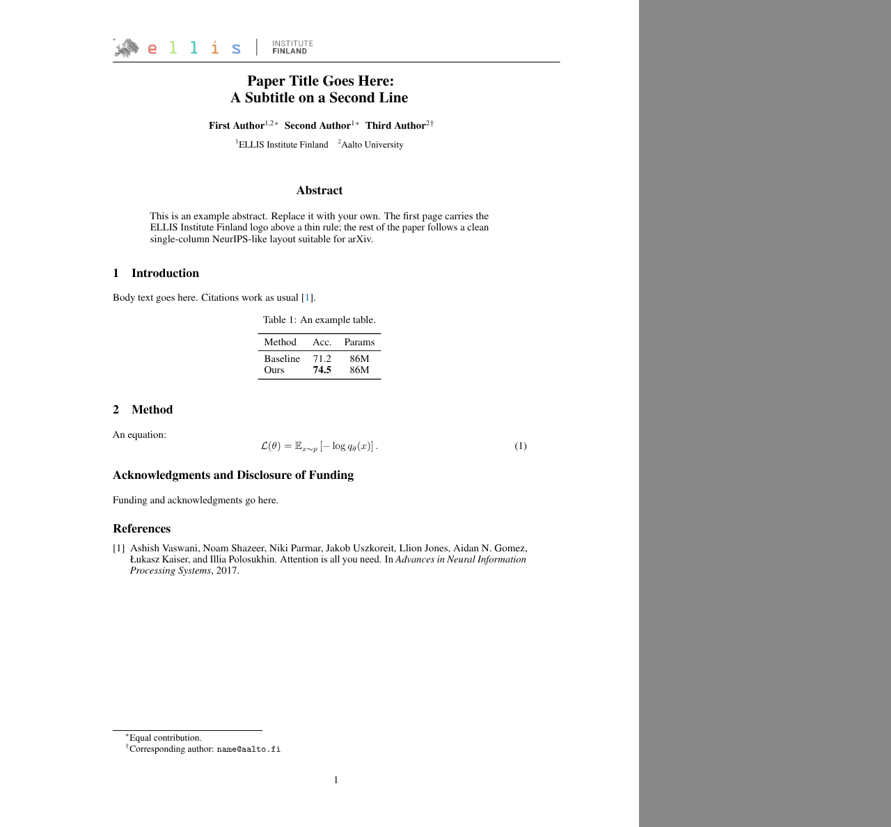

# arXiv template with ELLIS Institute Finland logo

A single-column, NeurIPS-style LaTeX template for posting papers to **arXiv** with the
**ELLIS Institute Finland** logo in the top-left corner of the first page, above a thin rule.
No cover page and no "technical report" framing: just the usual title, authors, abstract and body.



## Files

| File | Purpose |
|---|---|
| `arxiv-ellis.sty` | Style file (page layout, title block, logo header) |
| `ellis-institute-finland-logo.png` | Official ELLIS Institute Finland horizontal logo (transparent PNG, 2578×254) |
| `main.tex`, `references.bib` | Minimal example |
| `Makefile` | `make` builds the PDF, `make arxiv` packs an upload tarball |

## Converting a conference submission (NeurIPS / ICML / ICLR ...)

1. Copy `arxiv-ellis.sty` and `ellis-institute-finland-logo.png` next to your `main.tex`.
2. Replace the conference style line, e.g.

   ```latex
   % \usepackage[final]{neurips_2025}
   \usepackage{arxiv-ellis}
   ```

   `natbib` is loaded automatically. Set its options with
   `\PassOptionsToPackage{numbers,sort&compress}{natbib}` *before* `\usepackage{arxiv-ellis}`,
   or use `\usepackage[nonatbib]{arxiv-ellis}` and load natbib yourself.
3. For ICML/ICLR sources, also remove the conference-specific title macros
   (`\icmltitle`, `\icmlauthor`, `\iclrfinalcopy`, ...) and use plain `\title{}` / `\author{}`
   as in `main.tex`. Two-column ICML papers will be re-flowed into one column; check figure widths.
4. Compile with **pdflatex** (arXiv's default).

## Options

```latex
\usepackage[preprint]{arxiv-ellis}   % adds "Preprint. Under review." at the bottom of page 1
\ellislogo[17pt]{my-logo}            % change logo height and/or file (default 19pt)
\ellisnotice{Accepted at NeurIPS 2025.}  % custom footnote at the bottom of page 1
```

The `ack` environment (`\begin{ack} ... \end{ack}`) gives a NeurIPS-style
"Acknowledgments and Disclosure of Funding" section.

## Uploading to arXiv

```bash
make arxiv     # -> arxiv-upload.tar.gz with main.tex, main.bbl, .sty, logo
```

Include the generated `.bbl` (arXiv does not run BibTeX reliably), and copy your `figure/`
directory into `arxiv-upload/` before re-running `tar` if your paper has figures.

## Attribution and license

- The layout is adapted from the `report.sty` in the arXiv source of
  [arXiv:2609.35457](https://arxiv.org/abs/2609.35457) (Chen et al., 2026), distributed under
  [CC BY 4.0](https://creativecommons.org/licenses/by/4.0/). Changes: configurable logo,
  removal of anonymous-submission/line-number/checklist code, optional first-page notice.
- That file in turn derives from the NeurIPS 2024 style file by Roman Garnett and the authors of
  `nips15submit_e.sty`.
- The ELLIS Institute Finland logo is a trademark of ELLIS Institute Finland and is **not** covered
  by the license above. Use it only for work affiliated with the institute and follow its brand guidelines.
